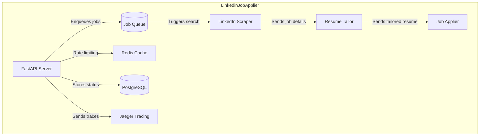
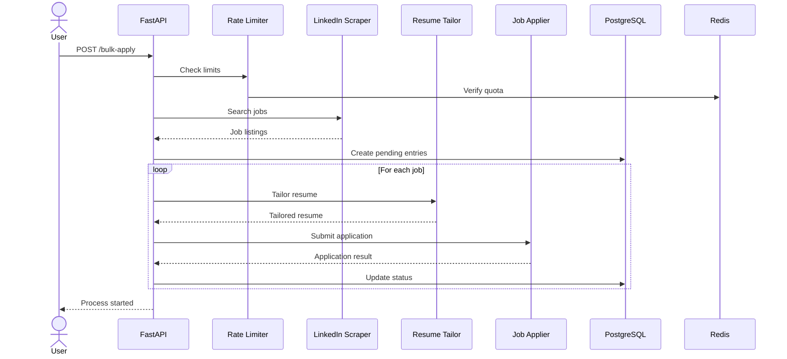

# LinkedinJobApplier

An automated system for bulk-applying to LinkedIn jobs with intelligent resume tailoring and rate limiting.

## Features

- Bulk job application automation
- Intelligent resume tailoring per job
- Rate limiting to avoid detection
- Proxy rotation support
- Application status tracking
- Distributed tracing with Jaeger
- Redis-based caching
- PostgreSQL for persistent storage

## System Architecture



## Installation

1. Clone the repository:
```bash
git clone https://github.com/yourusername/LinkedinJobApplier.git
cd LinkedinJobApplier
```

2. Set up environment:
```bash
python -m venv venv
source venv/bin/activate  # On Windows: .\venv\Scripts\activate
pip install -r requirements.txt
```

3. Configure settings in `config/config.yaml`:
```yaml
linkedin:
  username: your_email@example.com
  password: your_password
```

## Usage

### Start Services

```bash
docker-compose up -d
```

### API Endpoints

1. Bulk Apply:
```python
response = requests.post("http://localhost:8000/api/v1/bulk-apply", 
    json={
        "role": "Software Engineer",
        "location": "London",
        "visa_sponsorship": True,
        "work_type": "remote",
        "max_applications": 20
    }
)
```

2. Check Status:
```python
status = requests.get("http://localhost:8000/api/v1/application-status")
print(status.json())
```

### Monitoring

1. View application logs:
```bash
docker-compose logs -f app
```

2. Access Jaeger UI:
```bash
open http://localhost:16686
```

## Flow of Execution



## Rate Limits

- LinkedIn Search: 10 calls/hour
- Job Applications: 20 applications/day
- Resume Tailoring: 50 calls/hour

## Requirements

The following dependencies are required:

```txt
fastapi==0.68.1
uvicorn==0.15.0
sqlalchemy==1.4.23
psycopg2-binary==2.9.1
redis==4.0.2
requests==2.26.0
aiohttp==3.8.1
python-jose==3.3.0
pydantic==1.8.2
opentelemetry-api==1.7.1
opentelemetry-sdk==1.7.1
opentelemetry-exporter-jaeger==1.7.1
python-multipart==0.0.5
python-dotenv==0.19.0
beautifulsoup4==4.9.3
selenium==4.1.0
webdriver-manager==3.5.2
pyyaml==5.4.1
```
